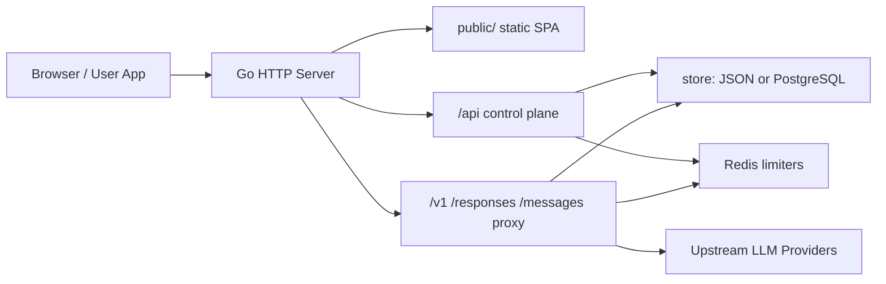
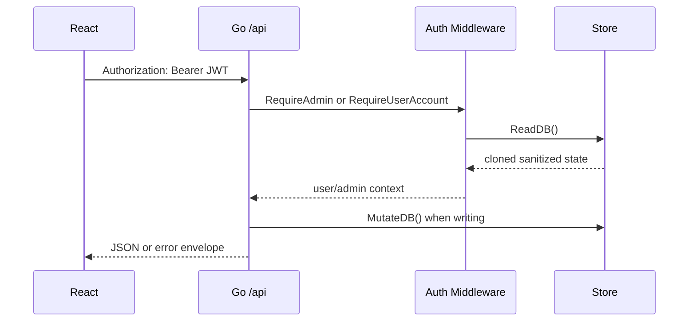
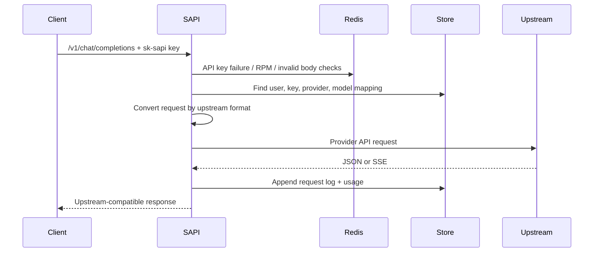

# 架构
SAPI 采用单体后端加静态前端结构。Go 后端同时承载 REST API、代理转发和前端静态资源；React 前端通过 Hash Router 风格页面切换管理端和用户端。

## 技术栈
- 后端: Go 1.22，标准库 `net/http` 路由。
- 前端: React 18，Vite，MUI，Recharts，Marked，Highlight.js。
- 默认状态存储: JSON 文件 `data/sapi.json`。
- 高流量状态存储: PostgreSQL `sapi_state` + `sapi_request_logs`。
- 限流和防爆破: Redis 优先，进程内内存兜底。
- 管理登录增强: WebAuthn Passkey。

## 进程结构

## 后端启动链路
`backend/main.go`:
1. `config.Load()` 读取 `.env` 和系统环境变量。
2. `setupDiagnosticLog()` 创建 `logs/v1chat-YYYY-MM-DD.log`。
3. `store.Init()` 初始化 JSON/PostgreSQL 状态。
4. `security.Init()` 初始化 Redis、请求限制、可信代理配置。
5. 挂载路由:
   - `handlers.MountPublicRoutes`
   - `handlers.MountAuthRoutes`
   - `handlers.MountUserRoutes`
   - `handlers.MountAdminRoutes`
   - `handlers.MountProxyRoutes`
6. 包裹中间件:
   - `security.RequestGuard`
   - `middleware.CORS`
   - `loggingMiddleware`
7. 后台每 60 秒执行 `proxy.RunHealthChecks()`。

## HTTP 分层
| 层 | 文件 | 职责 |
| --- | --- | --- |
| 入口 | `backend/main.go` | 路由装配、SPA 托管、日志、健康检查调度。 |
| Handler | `backend/handlers/*.go` | 请求解析、权限边界、响应格式。 |
| Middleware | `backend/middleware/middleware.go` | CORS、JWT 鉴权、API Key 查找、RPM、封禁。 |
| Security | `backend/security/security.go` | 请求体限制、可信代理 IP、Redis 限流、防爆破。 |
| Store | `backend/store/*.go` | JSON/PostgreSQL 状态、请求日志、迁移和清理。 |
| Proxy | `backend/proxy/*.go` | Provider 选择、上游格式转换、流式响应、健康状态。 |
| Usage | `backend/usage/usage.go` | 请求日志聚合、用户/Key/模型/日/小时统计。 |

## 前端结构
| 目录 | 职责 |
| --- | --- |
| `client/src/main.jsx` | App 状态、登录流、数据加载、路由切换、全局 Toast/Confirm。 |
| `client/src/pages/` | 首页、登录注册、用户控制台页面。 |
| `client/src/admin/` | 管理端 Provider、用户、订阅、SMTP、公告、建议、Passkey。 |
| `client/src/user/` | 用户用量、请求日志、热力图、代理配置示例。 |
| `client/src/components/` | 复用 UI 组件。 |
| `client/src/utils/` | API 请求、格式化、Markdown、Passkey 编码。 |
| `client/src/theme.js` | 明暗主题、颜色和 MUI token。 |

## SPA 托管
`npm run build` 输出到 `public/`。Go 后端:
- 对 `/assets/*` 设置 `Cache-Control: public, max-age=31536000, immutable`。
- 对 `index.html` 设置 `Cache-Control: no-store`。
- 对可压缩静态文件按请求 `Accept-Encoding: gzip` 动态缓存 gzip 版本。
- 非 API 路径回退到 `public/index.html`。

## 控制面请求链路

## 代理请求链路

## 状态模型
根状态为 `models.Database`:
- `Providers`: 上游 Provider、模型、映射、健康状态。
- `Users`: 普通用户、GitHub 信息、订阅分组、API Keys。
- `AdminAPIKeys`: 管理员级 API Key。
- `AdminPasskeys`: 管理员 WebAuthn 凭据。
- `RequestLogs`: 请求日志摘要，JSON 模式下加载最近 7 天。
- `InvitationCodes`: 邀请码。
- `VerificationCodes`: 邮箱验证码。
- `Announcements`: 公告。
- `Suggestions`: 建议反馈。
- `SMTPConfig`: 管理端保存的 SMTP 配置。
- `SiteBanner`、`MaintenanceMode`、`DefaultRPMLimit`。

## 存储架构
默认 JSON 模式:
- 主状态写入 `data/sapi.json`。
- 请求日志写入旁路 JSONL 文件，内存和主状态只保留最近摘要。
- 7 天前日志归档为 tar.gz 后清理。
- `MutateDB` 会 clone 状态、执行 mutator、normalize、持久化。

PostgreSQL 模式:
- `sapi_state`: 主状态 JSONB，不保存高频请求日志。
- `sapi_request_logs`: 请求日志、请求 JSON 内容、token、耗时、状态。
- 启动时自动建表和索引。
- 请求日志按 7 天归档 tar.gz 后清理。

## 性能设计
- 控制面和代理面共享一个 Go 进程，避免额外网关跳转。
- Provider 健康检查异步运行。
- Admin 状态接口默认不聚合 usage；usage 通过 `/api/admin/usage` 单独加载。
- 前端普通 admin 操作只刷新轻量状态；Provider 操作才刷新 health/model availability。
- 站内 Chat/生图通过 WebSocket 代理复用浏览器连接，模型列表按所选 API 来源动态读取 `/v1/models`。
- 外部自有 API 仅允许 HTTPS OpenAI 兼容路径，不跟随重定向。
- Vite manual chunks 拆分 UI、图表、Markdown、图标依赖，降低单 chunk 体积。
- 静态资源 hash 文件长期缓存，`index.html` 不缓存。

## 安全边界
- 管理端和用户控制面使用 JWT。
- 模型代理使用 SAPI API Key。
- Redis 优先处理登录、防爆破、API Key 失败、RPM、异常请求体封禁。
- API Key 请求体连续 20 次不合规会自动封禁 1 小时。
- 默认不信任代理头；只有 `SAPI_TRUST_PROXY_HEADERS=true` 且直连 IP 命中 `SAPI_TRUSTED_PROXY_CIDRS` 才读取真实客户端 IP。
- 请求体按控制面和代理面分开限流。
- 用户端隐藏 IP、设备和请求 JSON；完整审计只在服务端和管理端导出中可见。
